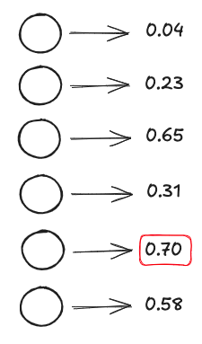

# Classification beyond XOR
In the XOR example we have a single perceptron output.  But what if we are trying
to classify someting into N distinct predictions?

## More outputs
Use a perceptron per classification possibility.  Select the highest weight among the
output perceptrons and that is the prediction.

The 'expected' output to train to is that every output is a zero except the expected
output.

# Inputs
Your inputs are pretty easy to predict.  How many different variables do you want to factor into 
the prediction model.

# Outputs
You need enough outputs to cover the range of acceptable predictions out of the model.  For binary, 
it's fine to have a single perceptron but for more than that use a perceptron per acceptable 
prediction.

# Hidden Layers
This is where things get tricky.  You can actually have multiple levels of hidden Layers
and each hidden layer can be of a different size.  This is a seperate and more complicated science
to trying to determine the optimal configuration for hidden layers.  

