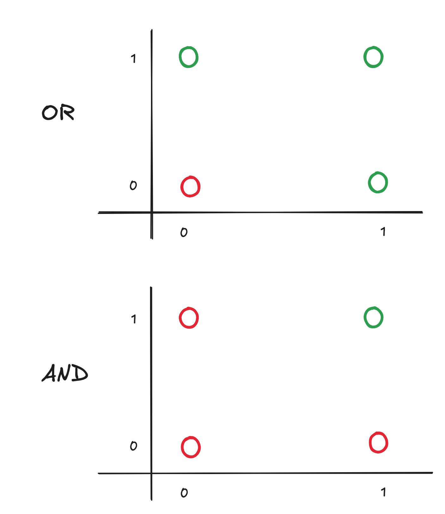

# Logic Gate Problem

Given that perceptrons can draw a clean line for classification, we'll apply that to a problem statement to replicate some simple logic gates.

# OR and AND

# NOR and NAND

# XOR

