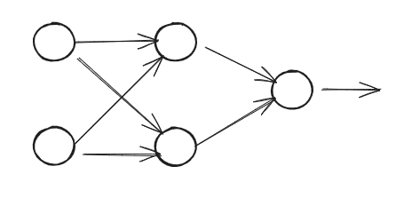

# Setup

Since `XOR` cannot be solved linearly another method must be employed.  One that
can adapt non-linearly.  Instead of using a single [Perceptron](Perceptron.md) we
will construct a network of Perceptrons with a hidden layer that will all interact with one another.

2 input nodes.  Then a hidden layer precedes the output node with the predicted result.

To initialize the network we randomize the weights and bias.

