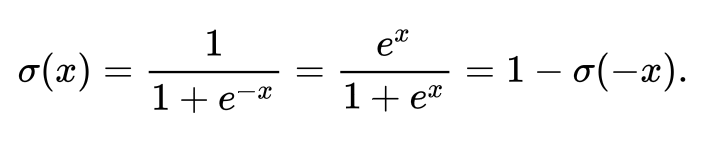
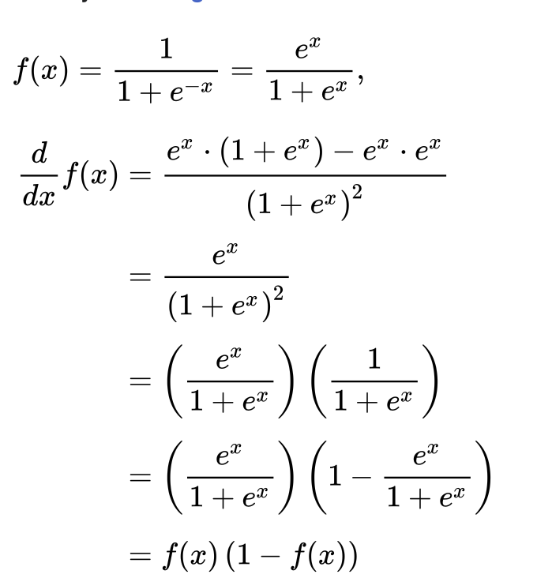

# Sigmoid Function

Maps floating numbers to values between 0 and 1.

This comes from the mathmatical definition of

The results of using this sigmoid function (aka: Logistic Function) is we get a nice mapping to a range space of 0.0 to 1.0 with a smooth continuous curve the yields a nice easy
derivative.

#### Images from Wikipedia
